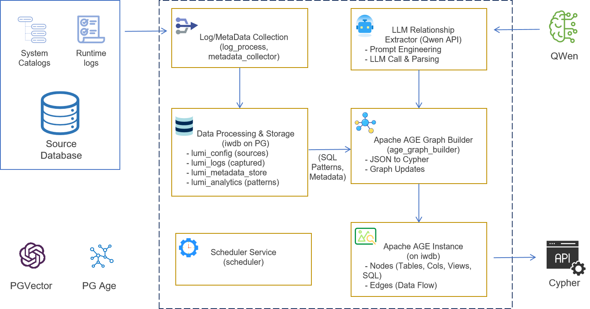
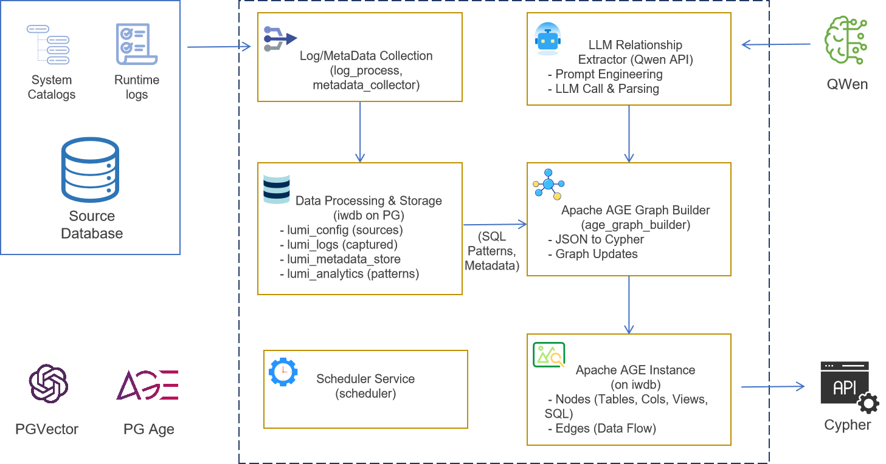

# ✨ PGLumiLineage: 点亮你的数据之旅 - 自动化数据血缘与知识图谱构建平台 ✨


**PGLumiLineage：借助大语言模型（LLM）与图数据库（Apache AGE），实现PG自动化数据血缘分析及知识图谱构建。**


## 🚀 项目简介：连接数据资产，赋能AI认知

在当今数据驱动的时代，助力大语言模型（LLM）深度理解企业内部纷繁复杂的数据生态至关重要。其关键的第一步，便是对企业元数据进行系统性的梳理，并构建清晰、准确的数据血缘关系。然而，传统的数据血缘梳理方法往往依赖人工、静态代码解析或昂贵的商业工具，普遍存在覆盖不全、更新滞后、成本高企等痛点。

**PGLumiLineage** 作为一个开源解决方案，致力于革新这一现状。本项目巧妙融合了前沿的大语言模型的智能分析能力与图数据库（Apache AGE）的结构化关联优势，旨在从PostgreSQL的运行时日志及元数据中，自动化地提取、分析并可视化数据血缘关系。

我们的愿景不止于此：PGLumiLineage致力于成为**企业级数据资产与知识资产的中枢**。通过深度融合Data+AI，我们不仅让人工智能协助企业高效梳理数据资产，更进一步利用由此产生的结构化、语义化的数据脉络来**反哺LLM，使其能充分理解企业数据背后所蕴含的独特知识体系与业务逻辑**。PGLumiLineage的最终目标是与LLM深度融合，为企业提供强大的知识中台服务能力，释放数据智能的无限潜能。

## ✨核心特性

* **一站式数据集成方案**: 借助PG生态，本方案会利用到PostgreSQL生态的apache age和pgvector来集成多模态数据，未来会基于大规模生产环境的需求，使用基于PG内核的MPP数据库Cloudberry。
* **自动化日志采集**: 通过SSH或本地文件方式，安全、自动地获取并处理数据库（目前基于PG开发，后续按需支持其他数据库的支持）的运行时日志（CSV格式）。
* **全面元数据收集**: 从源数据库中提取详尽的技术元数据（包括库、模式、表、视图、列、函数及其定义）,目前基于PG开发，后续会加入其他数据源支持。
* **智能SQL范式化与模式聚合**:
    * 运用 `sqlglot` 对日志及元数据中的原始SQL查询进行范式化处理，生成标准化的SQL模式。
    * 对日志中出现的SQL模式进行执行统计信息的聚合。
* **LLM驱动的关系提取**:
    * 利用大语言模型（初期集成通义千问Qwen，通过OpenAI兼容API调用）深度分析SQL模式、视图定义及函数逻辑。
    * 结合已收集的元数据构建丰富的上下文信息，增强LLM的理解与分析精度。
    * 提取细粒度至列级别的数据血缘关系及其他相关业务逻辑。
* **知识图谱构建**:
    * 将LLM提取出的结构化关系信息转换为Cypher图查询语句。
    * 在Apache AGE（PostgreSQL的图数据库扩展）中动态构建和维护数据血缘知识图谱。
* **灵活配置与高度扩展**:
    * 通过内部数据库集中管理数据源配置信息及同步调度策略。
    * 采用模块化的Python架构设计，为未来功能扩展（如Kafka集成、支持Cloudberry\Greenplum及其他数据库类型）奠定坚实基础。
* **动态与实时性**: 基于数据库运行时日志进行分析，能够捕获动态生成SQL及实际执行的数据转换链路，有效补充静态分析的不足。

## 🏛️ 系统架构概览

PGLumiLineage 采用模块化、面向服务的架构设计：

1.  **数据采集服务**: `log_processor`（日志处理器）和 `metadata_collector`（元数据收集器）负责从配置的源数据库收集原始SQL日志和技术元数据。
2.  **中央存储 (`iwdb`)**: 一个专用的PostgreSQL数据库，用于存储系统配置、经过初步处理的日志、提取的元数据以及聚合后的SQL模式。Apache AGE扩展也安装在此数据库中。
3.  **SQL范式化与聚合服务**: `sql_normalizer`（SQL范式化器）处理原始SQL（来自日志和元数据定义），创建唯一的、匿名的SQL模式，并聚合相关的统计信息。
4.  **LLM关系提取服务**: `llm_relationship_extractor`（LLM关系提取器）将SQL模式和相关的元数据上下文发送给大语言模型（如通义千问Qwen），以识别数据血缘关系。
5.  **AGE图谱构建服务**: `age_graph_builder`（AGE图谱构建器）将LLM的输出转换为Cypher查询，用以在Apache AGE中构建或更新数据血缘知识图谱。
6.  **调度服务**: 中央的 `scheduler`（调度器）根据在 `lumi_config.source_sync_schedules` 中定义的策略，编排和调度所有这些数据处理任务的执行。


## 技术栈

* **主要编程语言**: Python 3.10+
* **数据库 (中央存储与图数据库)**: PostgreSQL 15+ 及 Apache AGE 图数据库扩展
* **大语言模型 (LLM)**: 阿里云 通义千问 (Qwen) 系列 (通过DashScope OpenAI兼容API)
* **SQL解析/范式化**: `sqlglot`
* **异步处理**: `asyncio`, `asyncpg`
* **SSH连接**: `asyncssh`
* **数据校验与模型定义**: `Pydantic V2`

## 安装

1. 克隆仓库
2. 创建虚拟环境
   ```bash
   python3 -m venv lumiEnv
   source lumiEnv/bin/activate  # Linux/Mac
   # 或
   lumiEnv\Scripts\activate  # Windows
   ```
3. 安装依赖
   ```bash
   pip install -r requirements.txt
   ```
4. 复制环境变量模板并配置
   ```bash
   cp .env.example .env
   # 编辑 .env 文件，填入实际配置
   ```

## 使用方法

### 初始化系统

1. **初始化中央存储数据库**

   ```bash
   python -m pglumilineage.init_db
   ```
   
   此命令将创建所需的数据库架构、表和初始配置。

2. **安装 Apache AGE 扩展**

   在您的 PostgreSQL 数据库中安装 Apache AGE 扩展：
   
   ```sql
   CREATE EXTENSION age;
   ```

### 配置数据源

1. **添加 PostgreSQL 数据源**

   通过 SQL 或使用配置工具添加您要分析的 PostgreSQL 数据源：
   
   ```sql
   INSERT INTO lumi_config.data_sources (
     source_name, source_type, host, port, database, 
     username, password, log_path, log_format, enabled
   ) VALUES (
     '示例数据库', 'postgresql', 'localhost', 5432, 'example_db', 
     'postgres', 'your_password', '/var/log/postgresql/postgresql-15-main.log', 'csv', true
   );
   ```

2. **配置同步调度**

   设置数据源的同步调度策略：
   
   ```sql
   INSERT INTO lumi_config.source_sync_schedules (
     source_id, log_sync_interval_minutes, metadata_sync_interval_minutes, 
     enabled, last_log_sync, last_metadata_sync
   ) VALUES (
     1, 60, 1440, true, NULL, NULL
   );
   ```

### 运行各个服务模块

1. **启动日志处理器**

   ```bash
   python -m pglumilineage.log_processor.main
   ```

2. **启动元数据收集器**

   ```bash
   python -m pglumilineage.metadata_collector.main
   ```

3. **启动 SQL 范式化服务**

   ```bash
   python -m pglumilineage.sql_normalizer.main
   ```

4. **启动 LLM 分析器**

   ```bash
   python -m pglumilineage.llm_analyzer.main
   ```

5. **启动 AGE 图谱构建器**

   ```bash
   python -m pglumilineage.age_graph_builder.main
   ```

### 查询血缘关系

在 Apache AGE 中查询构建的数据血缘图：

```sql
-- 启用 AGE 扩展
SET search_path = ag_catalog, "$user", public;

-- 查询特定表的上游血缘
SELECT * FROM cypher('lineage_graph', $$
  MATCH (target:Table {name: '目标表名'})<-[:FLOWS_TO]-(source)
  RETURN source, target
$$) as (source agtype, target agtype);

-- 查询特定列的血缘关系
SELECT * FROM cypher('lineage_graph', $$
  MATCH (target:Column {name: '目标列名', table: '目标表名'})<-[:FLOWS_TO]-(source:Column)
  RETURN source.table, source.name, target.table, target.name
$$) as (source_table agtype, source_column agtype, target_table agtype, target_column agtype);
```

### 使用调度器

启动中央调度服务，自动按照配置的时间间隔执行各个模块：

```bash
python -m pglumilineage.scheduler.main
```

### 监控与管理

查看系统运行状态和统计信息：

```sql
-- 查看已处理的日志数量
SELECT COUNT(*) FROM lumi_raw_data.log_entries;

-- 查看已提取的SQL模式数量
SELECT COUNT(*) FROM lumi_analytical.sql_patterns;

-- 查看LLM分析状态
SELECT status, COUNT(*) 
FROM lumi_analytical.sql_patterns 
GROUP BY status;
```

## 开发者

- Vance Chen

## 许可证

Apache License 2.0
